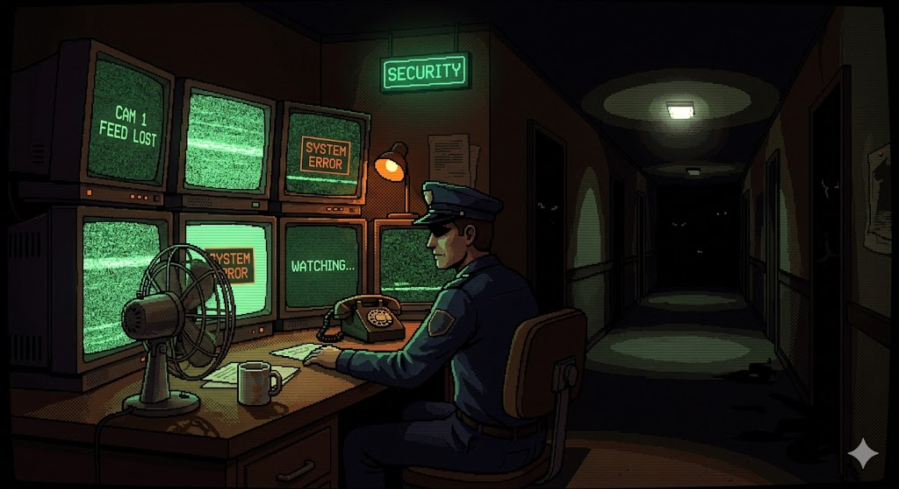

# 🐻 One Night in the Code's

Um jogo de "Survival Horror" baseado em navegador, inspirado no clássico Five Nights at Freddy's. Construído inteiramente com **HTML, CSS e Vanilla JavaScript**, sem o uso de motores de jogos (Game Engines) ou bibliotecas externas.



## 🎮 Sobre o Jogo
Você é o guarda de segurança noturno e seu objetivo é sobreviver das 12 AM às 6 AM. Monitore as câmeras, verifique os corredores e feche as portas para se proteger dos 4 animatrônicos, gerenciando sua energia limitada.

### ✨ Principais Funcionalidades
* **IA de Inimigos:** 4 animatrônicos com comportamentos e níveis de agressividade distintos que aumentam a cada noite (Noite 1 a 5).
* **Mecânica do Foxy:** Sistema exclusivo para o "Pirate's Cove", exigindo que o jogador monitore a câmera periodicamente para evitar um ataque rápido.
* **Gerenciamento de Recursos:** Sistema de energia dinâmico. O uso de portas, luzes e câmeras drena a bateria mais rápido.
* **Gráficos e Efeitos Visuais via CSS:** Perspectiva 2.5D do escritório usando `transform: perspective`, efeitos de estática nas câmeras e luzes piscando feitos puramente com animações CSS.
* **Minimapa Dinâmico:** Renderizado em tempo real utilizando a API do `<canvas>`.
* **Áudio Imersivo:** Manipulação de objetos `Audio` do JavaScript para passos, portas, cliques de câmera e Jumpscares.

## 🛠️ Tecnologias Utilizadas
* **HTML5:** Estruturação semântica e importação de SVGs inline.
* **CSS3:** Flexbox, Grid, Animações (`@keyframes`), Transformações 3D e Filtros.
* **JavaScript (ES6+):** Lógica de jogo (Game Loop), gerenciamento de estado, manipulação de DOM e timers (`setInterval`, `setTimeout`).

## 🚀 Como Jogar (Localmente)
1. Faça o clone deste repositório:
   ```bash
   git clone [https://github.com/SEU-USUARIO/one-night-in-the-codes.git](https://github.com/SEU-USUARIO/one-night-in-the-codes.git)
